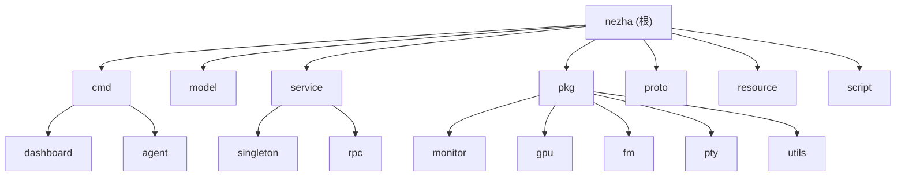

# CLAUDE.md

This file provides guidance to Claude Code (claude.ai/code) when working with code in this repository.

# 哪吒监控 (Nezha Monitoring)

## 变更记录 (Changelog)

*更新时间: 2025-09-21*

- 初始化项目架构文档
- 识别项目为分布式监控系统，包含Dashboard和Agent两大组件
- 发现项目经历重大重构：合并Agent仓库，移除NAT和DDNS功能
- 修复了安全漏洞：更新了13个依赖包的安全版本

## 项目愿景

哪吒监控是一个自托管、轻量级的服务器和网站监控运维工具。支持监控系统状态、HTTP（SSL证书变化、即将到期、已过期）、TCP、Ping，支持推送告警、定时任务和Web终端。

**核心特性：**
- 分布式架构：Dashboard面板 + Agent探针
- 多平台支持：Linux、Windows、macOS、FreeBSD等
- 丰富的监控指标：CPU、内存、磁盘、网络、GPU、温度等
- 灵活的告警机制：支持多种通知渠道
- Web终端：远程命令执行和文件管理
- 多主题支持：6种不同主题可选

## 架构总览

### 模块结构图



### 系统架构

```
┌─────────────────┐     gRPC/HTTP     ┌─────────────────┐
│   Dashboard     │◄─────────────────►│     Agents      │
│   (管理面板)     │                   │    (监控探针)    │
├─────────────────┤                   ├─────────────────┤
│ • Web UI        │                   │ • 系统监控        │
│ • 告警管理       │                   │ • 任务执行        │
│ • 用户认证       │                   │ • 远程终端        │
│ • 数据存储       │                   │ • 文件管理        │
│ • API服务       │                   │ • 自动更新        │
└─────────────────┘                   └─────────────────┘
```

## 模块索引

| 模块 | 路径 | 职责 | 状态 |
|------|------|------|------|
| Dashboard | [`cmd/dashboard/`](./cmd/dashboard/) | Web管理面板，提供UI、API、认证、数据存储 | ✅ 完整 |
| Agent | [`cmd/agent/`](./cmd/agent/) | 监控探针，收集系统信息并执行任务 | ✅ 完整 |
| 数据模型 | [`model/`](./model/) | 定义数据结构和业务模型 | ✅ 完整 |
| 核心服务 | [`service/`](./service/) | 业务逻辑和后台服务 | ✅ 完整 |
| 工具包 | [`pkg/`](./pkg/) | 可复用的工具和库 | ✅ 完整 |
| gRPC定义 | [`proto/`](./proto/) | RPC接口定义和生成代码 | ✅ 完整 |
| 静态资源 | [`resource/`](./resource/) | 前端资源和模板 | ✅ 完整 |
| 部署脚本 | [`script/`](./script/) | 安装和配置脚本 | ✅ 完整 |

## 运行与开发

### 环境要求

- Go 1.24.0+ (项目使用最新版本Go语言)
- SQLite3（默认数据库）
- 支持CGO（Dashboard构建需要）

### 快速启动

```bash
# 构建Dashboard
go build -o dashboard ./cmd/dashboard

# 构建Agent
go build -o agent ./cmd/agent

# 运行Dashboard（使用示例配置）
./dashboard -c script/config.yaml

# 运行Agent
./agent -s dashboard.example.com:5555 -p your_secret
```

### 开发环境

```bash
# 开发模式运行Dashboard
go run ./cmd/dashboard -c script/config.yaml

# 运行所有测试
go test ./...

# 运行特定包的测试
go test ./pkg/utils/
go test ./model/

# 生成protobuf代码（修改proto文件后执行）
bash script/proto.sh

# Docker开发环境
docker-compose -f script/docker-compose.yaml up
```

### 构建和部署

```bash
# 本地构建
go build -ldflags "-X main.version=dev -X main.commit=$(git rev-parse HEAD)" ./cmd/dashboard
go build -ldflags "-X main.version=dev -X main.commit=$(git rev-parse HEAD)" ./cmd/agent

# 跨平台构建 (示例)
GOOS=linux GOARCH=amd64 go build ./cmd/dashboard
GOOS=windows GOARCH=amd64 go build ./cmd/agent

# 使用安装脚本部署
curl -L https://raw.githubusercontent.com/naiba/nezha/master/script/install.sh -o nezha.sh && chmod +x nezha.sh && sudo ./nezha.sh
```

### 关键命令

| 命令 | 用途 |
|------|------|
| `go test ./...` | 运行所有测试 |
| `go test -v ./pkg/monitor/` | 运行单个包的详细测试 |
| `go build ./cmd/dashboard` | 构建Dashboard |
| `go build ./cmd/agent` | 构建Agent |
| `bash script/proto.sh` | 重新生成gRPC代码 |
| `go mod tidy` | 清理依赖 |
| `go vet ./...` | 静态代码检查 |

## 测试策略

### 测试覆盖

- **单元测试**: 位于各模块`*_test.go`文件
- **主要测试模块**:
  - `model/` - 数据模型测试
  - `pkg/utils/` - 工具函数测试
  - `pkg/monitor/` - 监控逻辑测试
  - `cmd/agent/` - Agent主逻辑测试

### CI/CD

- **测试环境**: Ubuntu, Windows, macOS
- **Go版本**: 1.24
- **安全扫描**: Gosec静态分析
- **构建验证**: 多平台交叉编译
- **自动发布**: GitHub Actions + GoReleaser
- **触发条件**: 推送到next分支或创建PR

## 编码规范

### Go代码风格

- 遵循官方Go代码规范
- 使用`gofmt`格式化代码
- 导入路径：`github.com/naiba/nezha`
- 错误处理：使用Go标准错误处理模式

### 项目结构

- `cmd/` - 应用程序入口点
- `pkg/` - 可导出的库代码
- `model/` - 数据模型定义
- `service/` - 业务逻辑层
- `resource/` - 静态资源文件
- `script/` - 部署和配置脚本

### 数据库

- ORM: GORM v1.25.10
- 默认: SQLite3
- 迁移: 自动迁移
- 连接: 支持多种数据库后端

## 关键技术细节

### gRPC通信

- 协议定义: `proto/nezha.proto`
- 生成代码: `proto/nezha.pb.go`
- 服务端: Dashboard提供gRPC服务
- 客户端: Agent连接并上报数据

### 安全特性

- TLS加密通信支持
- JWT认证机制
- OAuth2集成（GitHub等）
- 密钥安全存储
- 路径遍历攻击防护（ZIP解压安全实现）

### 监控能力

- 系统指标：CPU、内存、磁盘、网络
- 硬件监控：GPU使用率、温度传感器
- 服务监控：HTTP/HTTPS、TCP端口、Ping
- 自定义任务：定时脚本执行
- 文件管理：远程文件操作

## AI 使用指引

### 代码修改建议

1. **谨慎修改核心逻辑**: `service/singleton/` 包含关键业务逻辑
2. **gRPC接口变更**: 修改`proto/nezha.proto`后需要执行`bash script/proto.sh`重新生成代码
3. **数据模型变更**: 注意数据库迁移兼容性，测试升级路径
4. **跨平台兼容**: 特别注意Windows/Linux差异，尤其是路径处理和系统调用
5. **安全考虑**: 修改文件操作、网络请求、认证相关代码时要格外小心

### 常见任务

- **添加新监控指标**:
  1. 修改`proto/nezha.proto`添加新字段
  2. 运行`bash script/proto.sh`重新生成代码
  3. 在`pkg/monitor/`中实现采集逻辑
  4. 更新Dashboard显示逻辑
- **新增告警类型**: 扩展`model/alertrule.go`和`service/singleton/alertsentinel.go`
- **主题定制**: 修改`resource/template/`目录下的相应主题文件
- **API扩展**: 在`service/singleton/api.go`中添加新的API端点
- **Agent功能扩展**: 修改`cmd/agent/`中的相关处理逻辑

### 架构决策

- **为什么移除NAT/DDNS**: 专注核心监控功能，简化代码复杂度，提高维护性
- **为什么合并Agent**: 统一维护，减少依赖管理复杂性，简化发布流程
- **为什么使用gRPC**: 高性能、类型安全、支持流式传输，适合实时监控数据传输
- **为什么使用SQLite**: 默认零配置，适合小规模部署，支持升级到PostgreSQL/MySQL

## 重要注意事项

⚠️ **重大变更**:
- v0-final分支移除了NAT（内网穿透）和DDNS功能
- Agent代码已合并到主仓库
- 导入路径从`github.com/nezhahq/agent`更改为`github.com/naiba/nezha`

🔒 **安全相关**:
- 最近修复了13个安全漏洞（依赖包更新）
- 实现了安全的ZIP解压功能（防路径遍历攻击）
- 建议定期运行`go mod tidy`和依赖更新
- 生产环境建议启用TLS加密

📋 **开发提示**:
- 前端模板修改后需要重新构建
- Agent配置支持配置文件`config.yml`
- Dashboard支持环境变量配置
- 使用`script/config.yaml`作为开发配置参考
